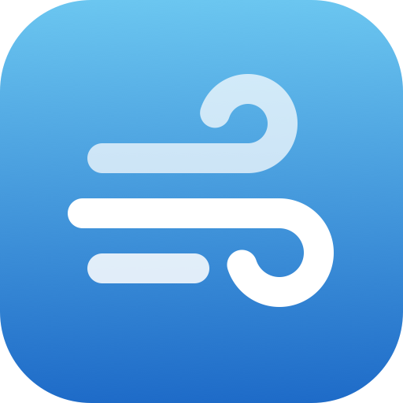

# Auster App Icon — Icon Composer Source

App icon artwork following the current HIG app-icon guidance (Liquid Glass,
guidance last refined 2026-06-08): layered, vector, unmasked square canvas,
no baked-in effects — the system supplies specular highlights, refraction, and
shadows.

**Concept:** Auster is the Latin south wind. A wind glyph drafted from clean
primitives — three thick horizontal gusts built from straight segments joined
tangent-continuously to perfect circular-arc curls, uniform stroke width,
round caps — over an azure gradient. No text, legible down to 16 px.

## Files

| File | Purpose |
|---|---|
| `AppIcon.icon/` | **The Icon Composer document** (a package: `icon.json` + `Assets/`). Open it directly in Icon Composer; add it to the Xcode project as the app icon (Xcode 26+ consumes `.icon` directly). |
| `AppIcon.icon/Assets/wind-{back,middle,front}.svg` | The three foreground layers — 1024×1024, fully opaque white, effect-free |
| `preview.svg` / `preview@512.png` | **Reference only** — flattened approximation with gradient, opacities, and corner mask baked in. Not an input to Icon Composer. |
| `generate.py` | Regenerates the layer SVGs (parametric geometry) |

The `.icon` document already encodes what the HIG says to configure in Icon
Composer: background as a native vertical linear gradient (`#6BC6F0 → #1E6BC8`),
layers ordered front → back (`wind-front` 85%, `wind-middle` 100%, `wind-back`
72%), default Liquid Glass settings (neutral shadow, translucency), square
canvases shared across platforms. Layer files stay fully opaque; opacity lives
in `icon.json` per the HIG.

> `icon.json` was authored by hand against the published format (validated
> against several real Icon Composer documents). The first time you open it in
> Icon Composer, verify: layer stacking (front gust on top in the sidebar),
> opacities, and the gradient — then re-save from Icon Composer to normalize.

## Appearance variants

Default is fully specified. Dark/clear/tinted are left to the system to derive
(HIG-sanctioned); if the dark variant needs tuning, set a dark background
override in Icon Composer of `#123E63 → #0A2540` and keep the white glyphs
unchanged. Preview all appearances and small sizes (16/32 px) in Icon Composer
before shipping.

## Regenerating / tweaking

`python3 generate.py` rewrites `AppIcon.icon/Assets/*.svg` and `preview.svg`
(render the PNG preview with `qlmanage -t -s 512 -o . preview.svg`). Stroke
geometry (run lengths, curl radii/sweep, stroke width, vertical rhythm,
optical-centering shifts) is parametrized at the bottom of the script.

## HIG conformance checklist

- [x] 1024×1024 square, unmasked layers (system masks corners)
- [x] Layered: background + 3 foreground layers for depth
- [x] Vector (SVG), outlined filled shapes, no strokes, no text
- [x] Fully opaque layer files; transparency applied in the Icon Composer document
- [x] Hard, clearly defined edges (no feathering/soft edges)
- [x] No baked speculars, shadows, bevels, glows, or blurs
- [x] Simple background (gradient) defined in the document, not an image
- [x] Primary content centered; safe margins (~200 px) respected
- [x] Consistent core features across default/dark/clear/tinted appearances
- [x] Legible at small sizes (verified at 64 px and 16 px equivalents)
